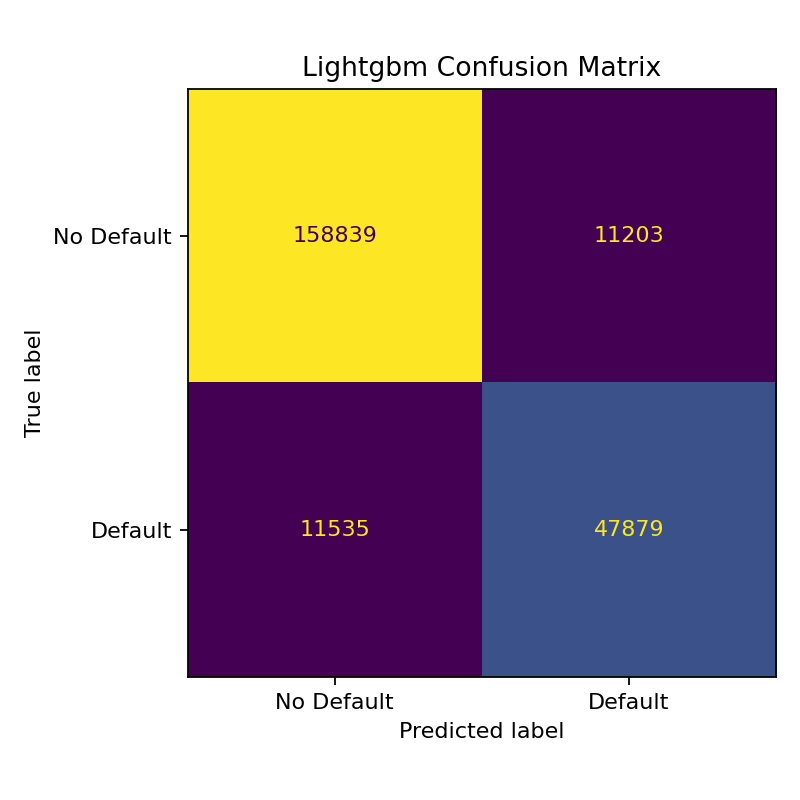
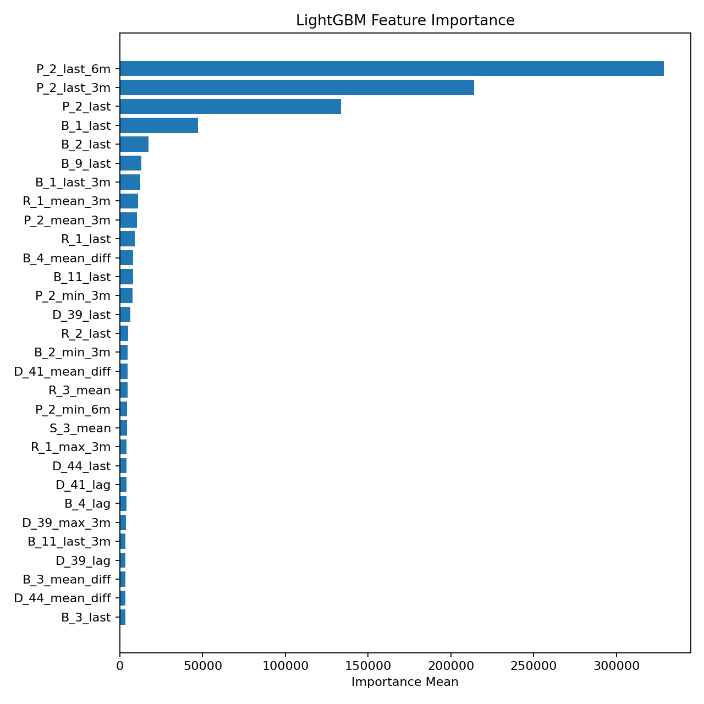
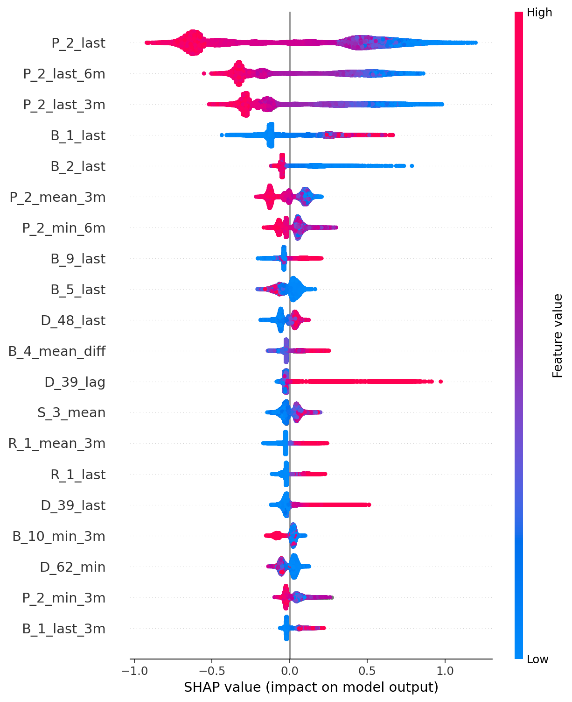

# American Express Credit Default Prediction

End-to-end machine learning project for predicting customer credit default risk from monthly American Express statement data. The project covers exploratory analysis, PySpark customer-level feature engineering, BigQuery feature storage, Vertex AI Pipelines orchestration, Optuna-tuned LightGBM training, SHAP explainability, PSI drift analysis, and FastAPI model serving.

## Highlights

- Built a binary classification pipeline for credit default prediction using the American Express Default Prediction dataset.
- Engineered `3,418` customer-level features from raw monthly statement records using aggregation, lag, recent-window, first-value, and difference features.
- Compared LightGBM and XGBoost with cross-validation on `229,456` customer-level rows.
- Implemented a GCP-native MLOps path using Dataproc Serverless, BigQuery, Vertex AI Pipelines, Vertex AI Custom Training, and GCS.
- Served the final LightGBM model with FastAPI through a single `/predict` endpoint that accepts recent customer statement history, creates request-level features, aligns them to the trained schema, and returns default risk.

## Results

| Model | Rows | Features | ROC-AUC | PR-AUC | Precision | Recall | F1 |
| --- | ---: | ---: | ---: | ---: | ---: | ---: | ---: |
| LightGBM | 229,456 | 3,418 | 0.9593 | 0.8938 | 0.8104 | 0.8059 | 0.8081 |
| XGBoost | 229,456 | 3,418 | 0.9597 | 0.8948 | 0.8124 | 0.8035 | 0.8079 |

The final serving model is LightGBM trained on all engineered training rows. The current Vertex workflow uses Optuna 5-fold stratified cross-validation for tuning and evaluation, then trains the final model once on the full feature table.

## LightGBM Evaluation




## Explainability





## Project Structure

```text
amex-credit-default/
├── app/                         # FastAPI application
│   ├── main.py
│   ├── model_loader.py
│   └── schemas.py
├── gcp/                         # GCP pipeline, Spark jobs, Vertex training, monitoring
│   ├── pipeline.py
│   ├── bigquery/
│   ├── monitoring/
│   ├── spark/
│   └── vertex/
├── docker/                      # Vertex training container
├── docs/images/                 # README plots
├── notebooks/                   # EDA, training, comparison, SHAP, MLflow, API demo
├── src/amex_default/            # Reusable ML pipeline code
│   ├── data.py
│   ├── evaluate.py
│   ├── features.py
│   ├── interpret.py
│   ├── predict.py
│   ├── tracking.py
│   ├── train_lightgbm.py
│   └── train_xgboost.py
├── artifacts/                   # Local generated models, plots, reports
├── data/                        # Local raw, processed, and prediction data
├── mlruns/                      # Local MLflow experiment store
├── amex_pipeline.json           # Compiled Vertex AI Pipeline spec
├── requirements.txt
└── README.md
```

`data/`, `artifacts/`, and `mlruns/` are local generated outputs and are ignored by Git. The GCP pipeline uses GCS, BigQuery, and Vertex AI for cloud execution.

## GCP Architecture

```text
Raw AMEX CSVs in GCS
        ↓
Dataproc Serverless PySpark preprocessing and feature engineering
        ↓
Feature Parquet in GCS
        ↓
BigQuery table: amex-credit-risk-ml.amex_ml.train_features
        ↓
Vertex AI Pipeline
        ↓
Vertex AI Custom Training: Optuna LightGBM tuning
        ↓
GCS tuned params: gs://amex-credit-risk-ml-data/models/lightgbm/tuning/
        ↓
Vertex AI Custom Training: final LightGBM training and evaluation
        ↓
GCS model artifacts, metrics, plots, feature importance, SHAP outputs
        ↓
FastAPI / serving layer for online default-risk scoring
```

Current GCP project and storage:

```text
Project: amex-credit-risk-ml
Region: us-central1
Bucket: gs://amex-credit-risk-ml-data/
Feature table: amex-credit-risk-ml.amex_ml.train_features
Model artifacts: gs://amex-credit-risk-ml-data/models/lightgbm/
```

## Vertex AI Pipeline

The current compiled pipeline starts from the existing BigQuery feature table because feature engineering has already been completed and loaded. In `gcp/pipeline.py`, the Dataproc preprocessing, Dataproc feature build, and BigQuery load steps are kept in the codebase for full reruns, but are commented out for the current run.

Current runnable Vertex AI steps:

1. `run-vertex-tuning-job`
   - Runs `gcp/vertex/tune_lightgbm_optuna.py`.
   - Reads `amex-credit-risk-ml.amex_ml.train_features`.
   - Runs Optuna tuning for LightGBM with 5-fold stratified cross-validation.
   - Writes best params and trial history to GCS.

2. `run-vertex-training-job`
   - Runs `gcp/vertex/train.py`.
   - Loads tuned params from GCS through `--params-uri`.
   - Trains one final LightGBM model on the full feature table.
   - Saves model artifacts, Optuna CV metrics, feature importance, and SHAP outputs to GCS.

Compiled pipeline spec:

```text
amex_pipeline.json
```

To restore a full end-to-end rerun from raw data, uncomment the Dataproc and BigQuery task blocks in `gcp/pipeline.py`, recompile `amex_pipeline.json`, and rerun the pipeline.

## GCP LightGBM Tuning

The Vertex AI pipeline runs Optuna tuning as a cloud step before final LightGBM training. The tuning job reads `amex-credit-risk-ml.amex_ml.train_features` and writes its best parameters to:

```text
gs://amex-credit-risk-ml-data/models/lightgbm/tuning/lightgbm_optuna_best_params.json
```

Final Vertex training loads that GCS file through `--params-uri`, records the Optuna CV score in `metrics.json`, and trains one final model on all available training rows.

## Drift Monitoring

Population Stability Index monitoring is implemented in `gcp/monitoring/drift_psi.py`. It compares a baseline BigQuery feature table against a current BigQuery feature table, writes drift metrics to BigQuery, and stores a CSV drift report in GCS.

Expected drift outputs:

```text
BigQuery metrics table: amex-credit-risk-ml.amex_ml.drift_metrics
GCS report: gs://amex-credit-risk-ml-data/monitoring/train_window_drift_report.csv
```

## FastAPI Serving

Start the API from the project root:

```bash
PYTHONPATH=src uvicorn app.main:app --reload
```

Open the interactive API docs:

```text
http://127.0.0.1:8000/docs
```

Prediction endpoint:

```text
POST /predict
```

The endpoint accepts recent monthly statement rows for one `customer_ID`, runs lightweight request-level feature aggregation only for that customer, aligns the generated features to the trained model schema, and returns a default probability. It does not rerun the full Dataproc feature pipeline at inference time.

Example request:

```json
{
  "statements": [
    {
      "customer_ID": "customer-1",
      "S_2": "2018-03-01",
      "P_2": 0.72,
      "D_39": 0.01,
      "B_1": 0.05,
      "B_2": 0.81,
      "D_63": "CR",
      "D_64": "O"
    }
  ]
}
```

Example response:

```json
{
  "default_probability": 0.0008122114740618201,
  "risk_category": "low",
  "customer_id": "customer-1",
  "n_statements": 13,
  "n_engineered_features": 3418
}
```

## MLflow Tracking

MLflow is used for local experiment tracking only. The GCP workflow uses Vertex AI jobs, GCS artifacts, BigQuery tables, and Cloud Logging for cloud execution and observability.

Start the local MLflow UI:

```bash
MLFLOW_ALLOW_FILE_STORE=true mlflow ui --backend-store-uri ./mlruns --port 5001
```

Open:

```text
http://127.0.0.1:5001
```

Tracked runs include:

- `lightgbm`
- `xgboost`
- `model_comparison`
- `final_lightgbm_model`

Tracked metrics include ROC-AUC, PR-AUC, precision, recall, F1, confusion matrix counts, training time, inference time, and cross-validation metrics.

Tracked artifacts include metrics reports, feature importance files, ROC/PR curves, confusion matrices, SHAP plots, model comparison plots, and final model files.

## Tech Stack

- Python
- Google Cloud Platform
- Dataproc Serverless
- BigQuery
- Vertex AI Pipelines
- Vertex AI Custom Training
- Google Cloud Storage
- Pandas, NumPy
- PySpark
- Scikit-learn
- LightGBM
- XGBoost
- Optuna
- SHAP
- MLflow
- FastAPI
