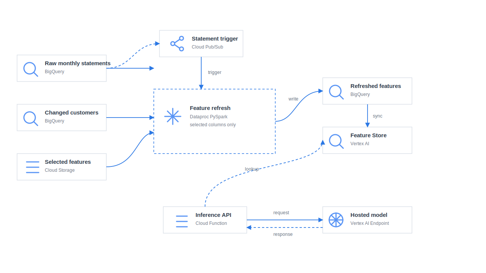

# American Express Credit Default Prediction

End-to-end credit default prediction project using monthly American Express statement data. The project combines PySpark feature engineering, BigQuery feature storage, Optuna-tuned LightGBM training, SHAP explainability, PSI drift monitoring, and a GCP statement-cycle inference path with Pub/Sub, Dataproc Serverless, Vertex AI Feature Store, Cloud Functions, and Vertex AI Endpoints.

## Highlights

- Designed and deployed an end-to-end credit default prediction pipeline on GCP, orchestrating distributed feature engineering, hyperparameter tuning, model training, and statement-cycle inference across monthly statement updates.
- Engineered 22+ behavioral, temporal, and statistical aggregations across delinquency, spend, payment, balance, and risk variables; optimized a LightGBM model via Optuna with stratified cross-validation, achieving a 0.959 ROC-AUC and 0.894 PR-AUC on imbalanced data.
- Logged model runs, metrics, and artifacts using MLflow, and implemented SHAP-based model explainability and Population Stability Index (PSI) analysis to interpret model predictions and assess potential feature drift.
- Built a statement-cycle inference pipeline where new monthly statement data triggers affected-customer PySpark feature refresh, BigQuery serving feature updates, Vertex AI Feature Store lookup, and Vertex AI Endpoint scoring.


## Results

| Model | Rows | Features | ROC-AUC | PR-AUC | F1 |
|---|---:|---:|---:|---:|---:|
| LightGBM | 229,456 | 3,418 | 0.9593 | 0.8938 | 0.8081 |
| XGBoost | 229,456 | 3,418 | 0.9597 | 0.8948 | 0.8079 |

## Architecture



```text
Training:   GCS → Dataproc Serverless (feature eng.) → BigQuery → Vertex AI Pipeline
            (Optuna + 5-fold CV → LightGBM) → Model Registry → Endpoint

Statement-Cycle Inference

New monthly statements -> BigQuery raw_monthly_statements_amex
        |
        v
Pub/Sub statement-cycle trigger
        |
        v
Dataproc Serverless PySpark affected-customer feature refresh
        |
        v
BigQuery refreshed customer features -> Vertex AI Feature Store
        |
        v
Cloud Function -> Vertex AI Endpoint -> default probability
```

## Repository Layout

```text
app/                 Local FastAPI demo
deployment/          GCP deployment and infrastructure scripts
inference/           Cloud Function online scoring entrypoint
gcp/                 Vertex pipeline, Spark jobs, serving, feature refresh, monitoring
streaming/           Pub/Sub/Dataflow experimental streaming utilities
src/amex_default/    Reusable feature engineering, training, evaluation utilities
notebooks/           EDA, training, comparison, SHAP, MLflow, API demo
docker/              Training and serving Dockerfiles
docs/images/         README plots
```

## Key GCP Resources

```text
Project:          amex-credit-risk-ml
Region:           us-central1
Bucket:           gs://amex-credit-risk-ml-data/
Feature table:    amex-credit-risk-ml.amex_ml.train_features
Train split:      amex-credit-risk-ml.amex_ml.train_features_train
Test split:       amex-credit-risk-ml.amex_ml.train_features_test
Serving features: amex-credit-risk-ml.amex_ml.customer_features_current
Model artifacts:  gs://amex-credit-risk-ml-data/models/lightgbm/
Tuning artifacts: gs://amex-credit-risk-ml-data/models/lightgbm/tuning/
Endpoint:         amex-credit-default-endpoint
Feature store:    amex_credit_default_feature_store
Feature view:     customer_features_current
```

## Run

Compile the Vertex AI pipeline:

```bash
python -m gcp.pipeline
```

Run an affected-customer statement-cycle feature refresh:

```bash
gcloud dataproc batches submit pyspark gcp/spark/refresh_selected_features.py \
  --project=amex-credit-risk-ml \
  --region=us-central1 \
  --deps-bucket=gs://amex-credit-risk-ml-data \
  --py-files=gcp/spark/amex_default.zip \
  -- \
  --raw-table=amex-credit-risk-ml.amex_ml.raw_monthly_statements_amex \
  --changed-customers-table=amex-credit-risk-ml.amex_ml.changed_customers_statement_cycle \
  --feature-table=amex-credit-risk-ml.amex_ml.customer_features_current \
  --staging-table=amex-credit-risk-ml.amex_ml.customer_features_current_refresh_staging \
  --selected-features-uri=gs://amex-credit-risk-ml-data/models/lightgbm/selected_feature_list.json
```

Deploy the online stack:

```bash
SERVING_IMAGE_URI=<artifact-registry-serving-image> \
ALERT_EMAIL=<email> \
python deployment/run_deployment.py
```

## Tech Stack

Python, PySpark, Pandas, NumPy, Scikit-learn, LightGBM, XGBoost, Optuna, SHAP, MLflow, FastAPI, BigQuery, GCS, Dataproc Serverless, Vertex AI Pipelines, Vertex AI Feature Store, Vertex AI Endpoints, Cloud Functions, Pub/Sub, and Dataflow.
