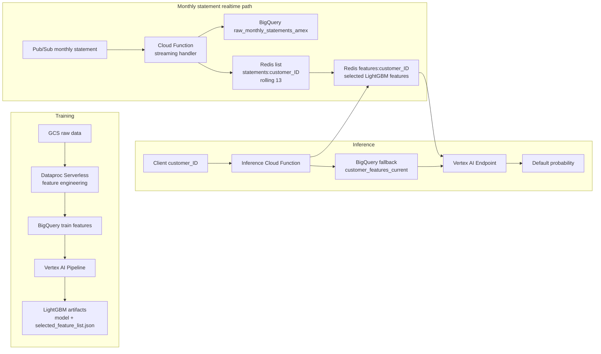

# American Express Credit Default Prediction

Credit default prediction on monthly American Express statement data. The project trains a LightGBM model with engineered behavioral features, deploys training/scoring on GCP, and supports low-latency monthly statement updates with Redis.

## Results

| Model | Rows | Features | ROC-AUC | PR-AUC | F1 |
|---|---:|---:|---:|---:|---:|
| LightGBM | 229,456 | 3,418 | 0.9593 | 0.8938 | 0.8081 |
| XGBoost | 229,456 | 3,418 | 0.9597 | 0.8948 | 0.8079 |

## Architecture



## What It Does

- Builds customer-level AMEX credit risk features from monthly statements.
- Selects the LightGBM feature set and saves `selected_feature_list.json`.
- Keeps a Redis rolling 13-statement window per customer for realtime updates.
- Recomputes only selected model features when a new monthly statement arrives.
- Scores through a Vertex AI Endpoint, using Redis first and BigQuery as fallback.

## Key Paths

```text
src/amex_default/    Feature engineering and model utilities
gcp/                 Vertex, Dataproc, BigQuery, monitoring code
streaming/           Pub/Sub monthly statement handler
inference/           Online scoring Cloud Function
deployment/          GCP deployment helpers
docker/              Training and serving Dockerfiles
notebooks/           EDA, training, comparison, SHAP, MLflow
```

## GCP Resources

```text
Project:     amex-credit-risk-ml
Region:      us-central1
Bucket:      gs://amex-credit-risk-ml-data/
Raw table:   amex-credit-risk-ml.amex_ml.raw_monthly_statements_amex
Features:    amex-credit-risk-ml.amex_ml.customer_features_current
Predictions: amex-credit-risk-ml.amex_ml.customer_default_predictions
Artifacts:   gs://amex-credit-risk-ml-data/models/lightgbm/
```

## Run

Build and push containers:

```bash
ARTIFACT_REGISTRY_REPOSITORY=amex-credit-default IMAGE_TAG=latest ./deployment/build_images.sh
```

Compile the Vertex AI pipeline:

```bash
python -m gcp.pipeline
```

Deploy streaming ingest:

```bash
python deployment/setup_streaming_pubsub.py
python deployment/setup_vpc_connector.py
python deployment/deploy_streaming_function.py \
  --redis-host=<memorystore-private-ip> \
  --vpc-connector=amex-vpc-connector
```

Deploy online inference:

```bash
python deployment/deploy_inference_function.py \
  --vertex-endpoint-id=<vertex-endpoint-id> \
  --redis-host=<memorystore-private-ip> \
  --vpc-connector=amex-vpc-connector
```

## Stack

Python, PySpark, Pandas, LightGBM, XGBoost, Optuna, SHAP, MLflow, FastAPI, BigQuery, GCS, Dataproc Serverless, Pub/Sub, Redis/Memorystore, Cloud Functions, Vertex AI Pipelines, Vertex AI Endpoints.
