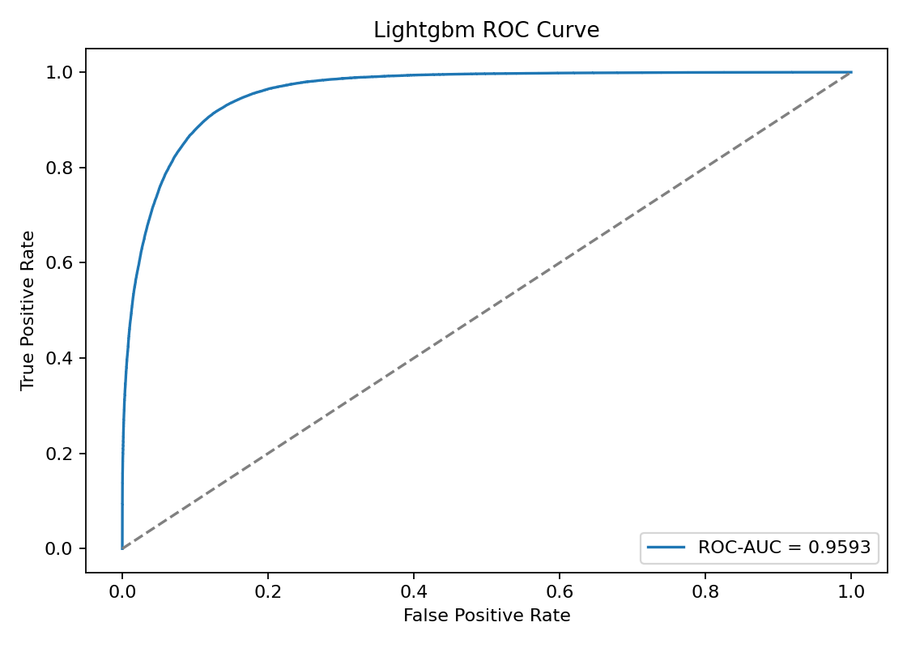
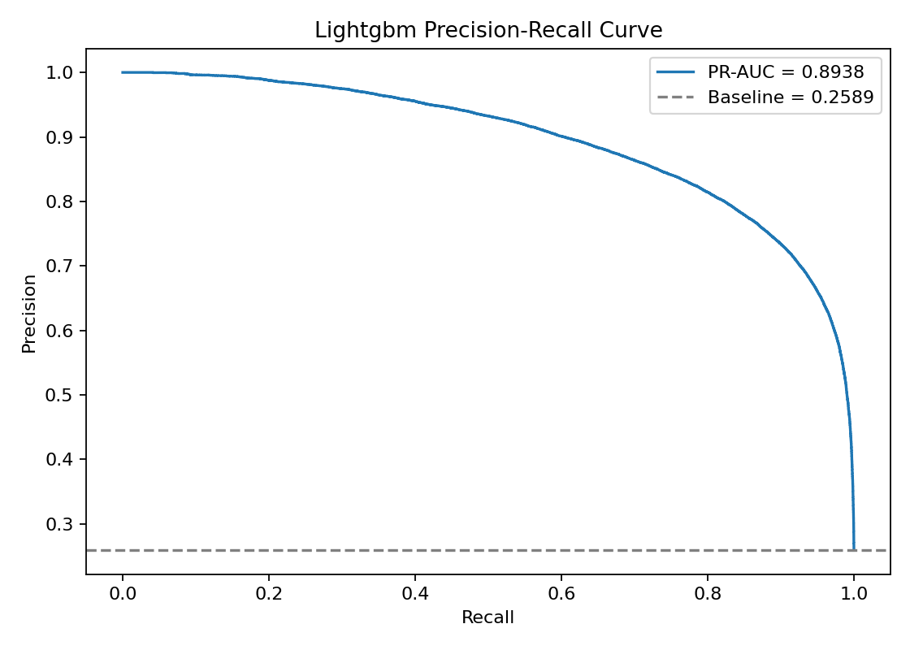

# American Express Credit Default Prediction

End-to-end credit default prediction project using monthly American Express statement data. The project combines PySpark feature engineering, BigQuery feature storage, Optuna-tuned LightGBM training, SHAP explainability, PSI drift monitoring, and a GCP online inference path with Vertex AI, Cloud Functions, Redis, Pub/Sub, and Dataflow.

## Highlights

- Designed and deployed an end-to-end credit default prediction pipeline on GCP, orchestrating distributed feature engineering, hyperparameter tuning, model training, and real-time inference across monthly statement cycles.
- Engineered 22+ behavioral, temporal, and statistical aggregations across delinquency, spend, payment, balance, and risk variables; optimized a LightGBM model via Optuna with stratified cross-validation, achieving a 0.959 ROC-AUC and 0.894 PR-AUC on imbalanced data.
- Logged model runs, metrics, and artifacts using MLflow, and implemented SHAP-based model explainability and Population Stability Index (PSI) analysis to interpret model predictions and assess potential feature drift.
- Built a three-tier real-time inference pipeline using Redis as an online feature store, BigQuery as a fallback lookup, and Vertex AI Endpoint for model serving, with streaming feature updates via Pub/Sub and Dataflow on each statement cycle close.


## Results

| Model | Rows | Features | ROC-AUC | PR-AUC | Precision | Recall | F1 |
| --- | ---: | ---: | ---: | ---: | ---: | ---: | ---: |
| LightGBM | 229,456 | 3,418 | 0.9593 | 0.8938 | 0.8104 | 0.8059 | 0.8081 |
| XGBoost | 229,456 | 3,418 | 0.9597 | 0.8948 | 0.8124 | 0.8035 | 0.8079 |

The Vertex workflow uses Optuna 5-fold stratified cross-validation for tuning and evaluation, then trains one final LightGBM model on the selected feature subset.

## Evaluation





## Architecture

```text
Training / MLOps

Raw AMEX CSVs in GCS
        |
        v
Dataproc Serverless PySpark preprocessing + feature engineering
        |
        v
BigQuery train_features
        |
        v
Vertex AI Pipeline
        |
        +--> Optuna + 5-fold stratified CV
        |
        +--> Final LightGBM training + feature selection
        |
        v
GCS model artifacts + metrics + SHAP
        |
        v
Vertex AI Model Registry -> Vertex AI Endpoint


Online Inference

Cloud Function: score(customer_ID)
        |
        +--> Tier 1: Redis feature cache
        |
        +--> Tier 2: BigQuery feature lookup + Redis write-through
        |
        +--> Tier 3: insufficient data response
        |
        v
Vertex AI Endpoint -> default probability


Streaming Refresh

Pub/Sub statement-cycle-close
        |
        v
Dataflow streaming job
        |
        v
Incremental Redis feature update
```

## Repository Layout

```text
app/                 Local FastAPI demo
deployment/          GCP deployment and infrastructure scripts
inference/           Cloud Function online scoring entrypoint
gcp/                 Vertex pipeline, Spark jobs, serving, Redis, monitoring
streaming/           Dataflow streaming feature-refresh job
src/amex_default/    Reusable feature engineering, training, evaluation utilities
notebooks/           EDA, training, comparison, SHAP, MLflow, API demo
docker/              Training and serving Dockerfiles
docs/images/         README plots
```

## Key GCP Resources

```text
Project:          amex-credit-risk-ml
Region:           us-central1
Bucket:           gs://amex-credit-risk-ml-data/
Feature table:    amex-credit-risk-ml.amex_ml.train_features
Model artifacts:  gs://amex-credit-risk-ml-data/models/lightgbm/
Tuning artifacts: gs://amex-credit-risk-ml-data/models/lightgbm/tuning/
Endpoint:         amex-credit-default-endpoint
Redis:            amex-feature-cache
```

## Pipeline Outputs

```text
models/lightgbm/
  model.txt
  metrics.json
  selected_feature_list.json
  full_feature_list.json
  feature_importance.csv
  plots/
  mlruns/

models/lightgbm/tuning/
  lightgbm_optuna_best_params.json
  lightgbm_optuna_trials.csv
  cv_metrics.json
  cv_classification_report.json
```

## Run

Compile the Vertex AI pipeline:

```bash
python -m gcp.pipeline
```

Provision Redis:

```bash
bash gcp/redis/provision_memorystore.sh
```

Refresh Redis feature cache:

```bash
REDIS_HOST=<memorystore-host> python deployment/refresh_redis.py
```

Deploy the online stack:

```bash
SERVING_IMAGE_URI=<artifact-registry-serving-image> \
REDIS_HOST=<memorystore-host> \
ALERT_EMAIL=<email> \
python deployment/run_deployment.py
```

## Tech Stack

Python, PySpark, Pandas, NumPy, Scikit-learn, LightGBM, XGBoost, Optuna, SHAP, MLflow, FastAPI, BigQuery, GCS, Dataproc Serverless, Vertex AI Pipelines, Vertex AI Endpoints, Cloud Functions, Pub/Sub, Dataflow, Memorystore Redis.
